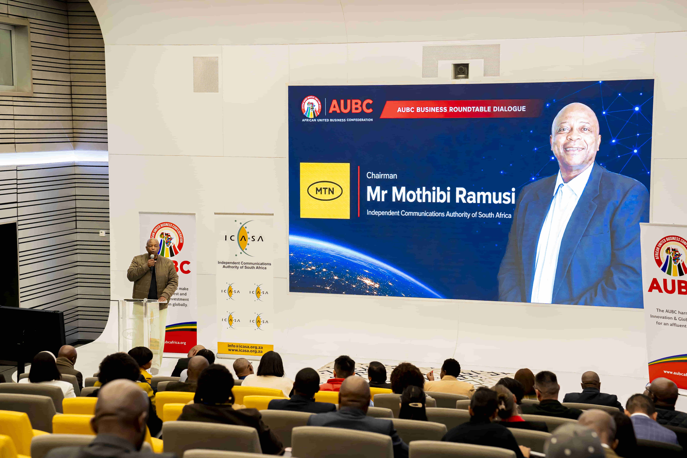

# JIKAJIKA MEDIA (PTY) LTD - OFFICIAL CORPORATE WEBSITE

> South Africa's Premier Corporate Media & Event Production Powerhouse.  
> Specializing in **Audio Visuals & LED Video Walls**, **Professional Photography**, **4K Videography & Drone Cinematography**, **Branding**, and **Large Format Signage**.



---

## 🌟 Overview

**Jikajika Media (Pty) Ltd** is a 100% black-owned South African corporate media production company based in Philippi, Cape Town. Founded in 2018 by Managing Director **Zukisa Jika-jika**, the company delivers broadcast-grade audio-visual infrastructure, technical stage lighting, high-end commercial photography, and cinematic video documentation for South Africa's premier enterprises, universities, and government bodies (including MTN, ICASA, AUBC, CPUT, and more).

---

## 🚀 Key Features

- **Animated Hero Slider**: Full-screen dynamic slider with 5 real high-resolution event production backgrounds, smooth zoom/fade transitions, and autoplay controls.
- **Official Brand Design System**: Crafted around the official logo palette:
  - **Crimson Red (`#C8232C`)**
  - **Corporate Navy (`#163A63` / `#0A192F`)**
  - **Sky Accent Blue (`#2573B7`)**
  - Modern glassmorphic surfaces with dark obsidian backdrops.
- **Dedicated Service Showcases**:
  - **Audio Visuals & LED Screens**: P2.6/P3.9 indoor & outdoor modular LED matrices, line-array PA sound engineering, intelligent lighting, and hybrid multi-platform streaming.
  - **Corporate Photography**: Executive portraits, business roundtable summits, galas, and academic graduation shoots.
  - **Videography Services**: 4K corporate documentaries, licensed aerial drone cinematography, and rapid-turnaround same-day social media reels.
  - **Branding & Print**: Logo identity, event media backdrops, pull-up banners, and vehicle fleet wraps.
- **Interactive Work Showcase & Lightbox**: Filterable portfolio grid by category (Audio Visuals, Photography, Videography, Galas) with full-screen lightbox preview.
- **Interactive Quotation Estimator & WhatsApp Direct Integration**: Fast inquiry builder that formats project requirements and connects instantly to the production desk.
- **Mobile Responsive & Smooth Scrolling**: Optimized for desktop, tablet, and mobile screens.

---

## 📁 Repository Structure

```
├── index.html                  # Main homepage with all corporate sections
├── services.html               # Dedicated service catalog & spec sheets
├── portfolio.html              # Filterable high-res portfolio showcase
├── about.html                  # Corporate story, founder profile, and values
├── contact.html                # Booking inquiry form, map & FAQ
├── css/
│   ├── style.css               # Corporate design system, colors & layout
│   └── animations.css          # Keyframes, hover glows & scroll-reveal transitions
├── js/
│   ├── main.js                 # Sticky nav, quote calculator & WhatsApp integration
│   ├── slider.js               # Animated sliding hero logic & swipe controls
│   └── portfolio.js            # Category filter & full-screen lightbox
├── assets/
│   └── images/
│       ├── hero/               # High-resolution hero background images
│       ├── gallery/            # Corporate event & production photography
│       └── logos/              # Official brand logos and favicon
└── .github/workflows/deploy.yml # Automated GitHub Pages CI/CD deployment
```

---

## 🛠️ Local Development & Preview

You can run this website with any static server:

```bash
# Using Python (if installed)
python -m http.server 8000

# Using Node.js npx
npx serve .
```

Then visit `http://localhost:8000` (or `http://localhost:3000`) in your browser.

---

## 🌐 Live Deployment on GitHub Pages

This repository is pre-configured with a GitHub Actions workflow (`.github/workflows/deploy.yml`).

To enable GitHub Pages:
1. Go to repository **Settings** > **Pages**.
2. Under **Build and deployment**, set **Source** to **GitHub Actions**.
3. Any push to the `main` branch will automatically build and publish the site live!

---

## 📞 Production Desk & Contact Details

- **Company**: Jika-jika Media (PTY) Ltd
- **Managing Director**: Zukisa Jika-jika
- **Phone / WhatsApp**: [+27 73 566 0267](tel:+27735660267)
- **Email**: [info@jikajikamedia.co.za](mailto:info@jikajikamedia.co.za)
- **Studio Address**: 11569 Ndwana Crescent, Browns Farm, Philippi, Cape Town, 7750
- **Registration**: 2018/395671/07 (100% Black-Owned Enterprise)

---
© 2026 Jika-jika Media (PTY) Ltd. All Rights Reserved.
